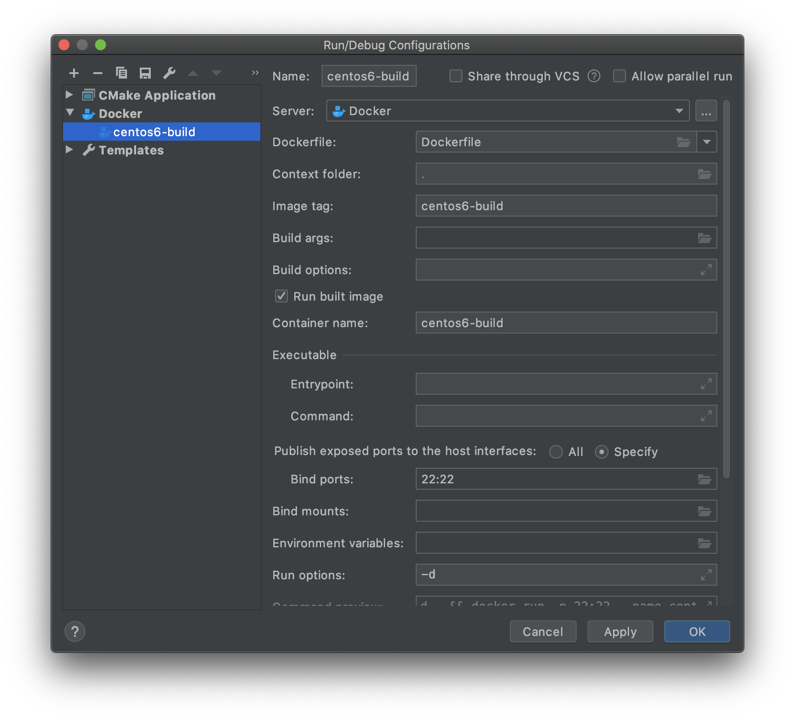
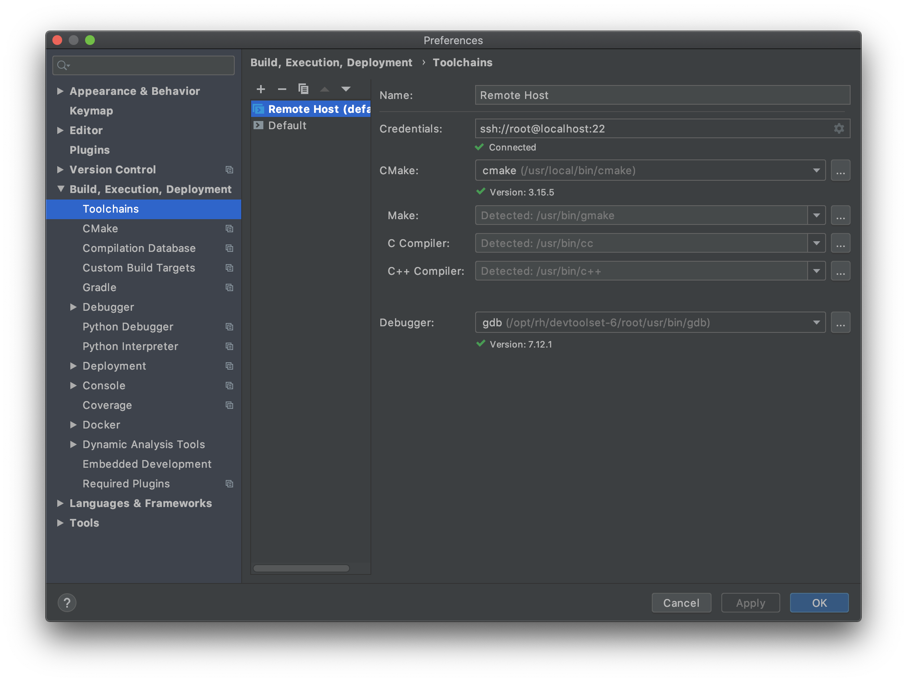
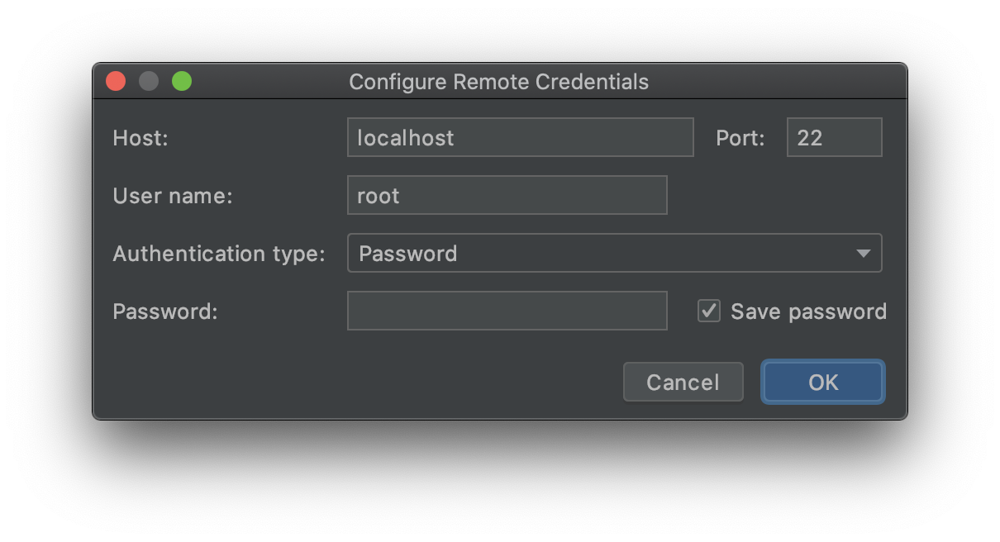

# CLion settings

### Run/Debug Configurations

- Edit Configurations
    1. Add New Configurations (⌘N)
	2. Docker > Dockerfile
	    - Name: docker build
	    - Dockerfile: Dockerfile
		- Image tag: (optional)
		- Container name: (optional)
		- Bind ports: 22:22
		- Run options: -d
- Run 'docker build and run'

### Preferences (⌘,)

- Build, Executin, Deployment > Toolchains
    1. Add Remote Host
	2. Credentials
	    - ssh://root@localhost:22
		
	3. CMake
	    - /usr/local/bin/cmake
	4. Debugger
	    - /opt/rh/devtoolset-6/root/usr/bin/gdb
- Deployment
    - Mappings
	    - Deployment path (optional)

   
